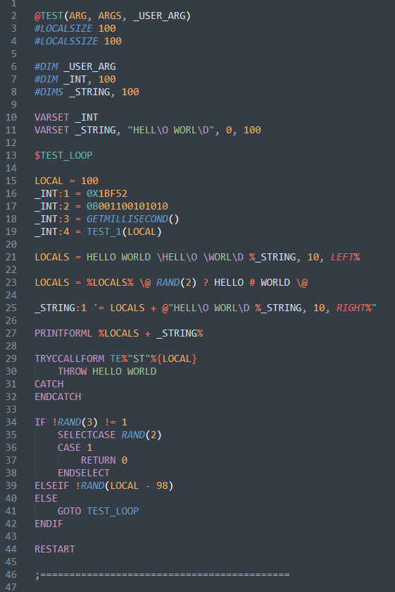
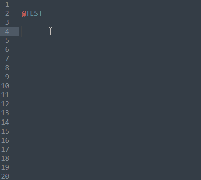
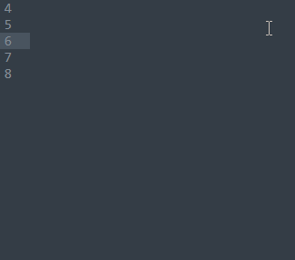
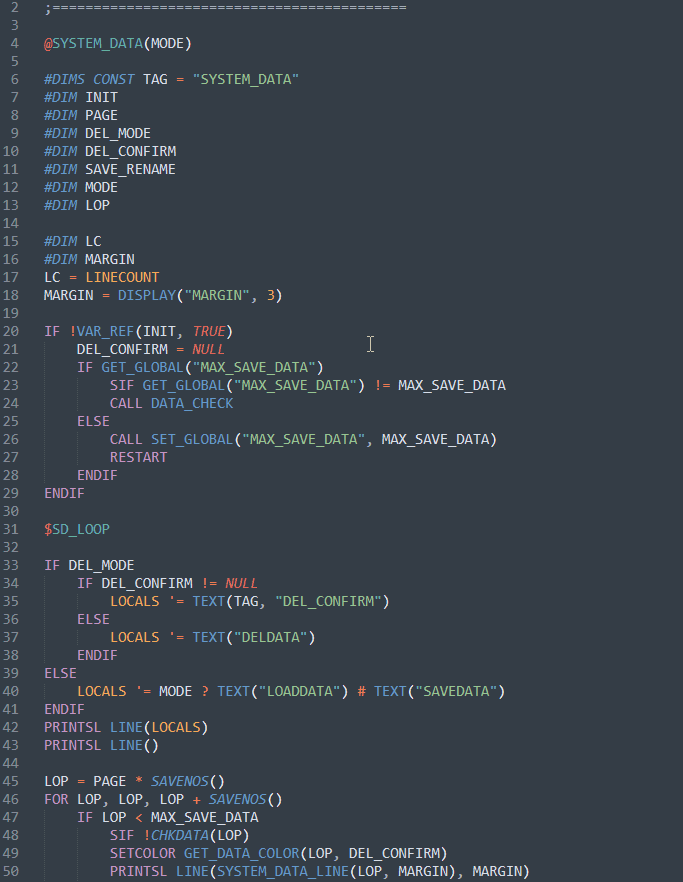
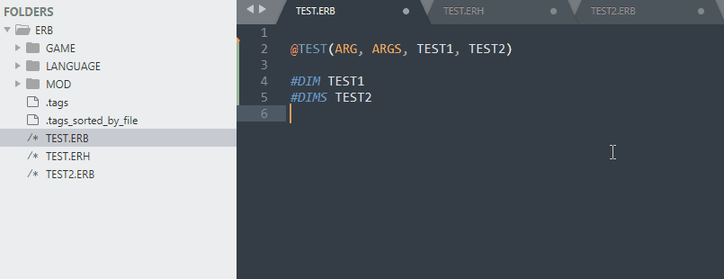

# Sublime-EraBasic
EraBasic syntax package for [Sublime Text 3](http://www.sublimetext.com/).

The syntax and keywords refer to [Emuera Wiki](https://osdn.net/projects/emuera/wiki/FrontPage).

## Installation
Use `Package Control: Install Package` command to subscribe `EraBasic`

## Instructions

### Syntax Highlighting

### Full Keyword

### Auto Complete

### Goto Definition

## Ctags Expansion

**Before using it, please ensure your Sublime is in the Project-Environment, and subscribe 'CTags' Package in Sublime**

### Preparation
1. Download [Exuberant Ctags](http://ctags.sourceforge.net/) from the official website
2. Open the `ctags58.zip` package and unzip the `ctags.exe` file to `C:\Windows\System32`
4. Open the plugin directory of Sublime, and find the `EraBasic` folder
5. Find the `.ctags` file in the folder, copy or move it to `C:\Users\(your computer name)`
