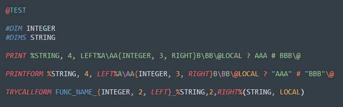

# Sublime-EraBasic

## Description
EraBasic syntax package for Sublime Text 3, The syntax and keywords refer to [Emuera Wiki](https://osdn.net/projects/emuera/wiki/FrontPage).

## Installation

* Use [Package Control](https://packagecontrol.io/docs/usage) to install `EraBasic`

## Instructions

#### Syntax Highlighting

#### Full Keyword

#### Auto Complete

#### Function Jump

