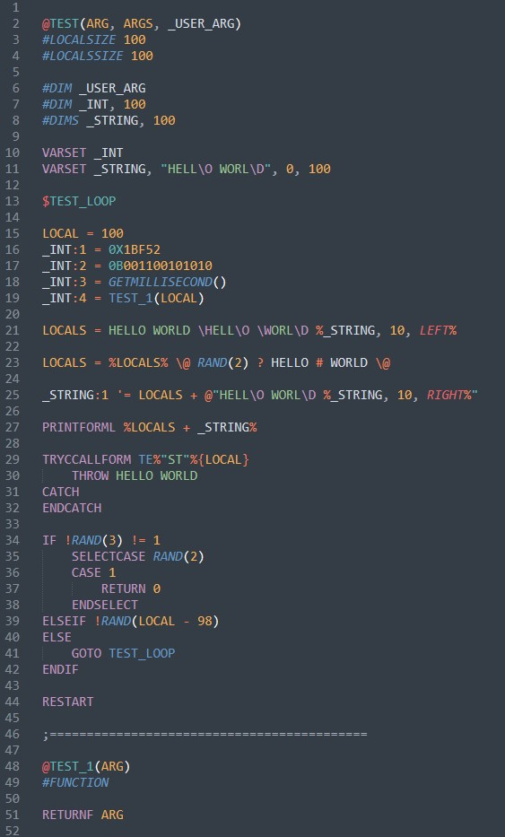

# Sublime-EraBasic

## 介绍
这是一款在 [Sublime Text 3](http://www.sublimetext.com/) 上为 EraBasic 语言提供语法高亮，全关键字提示，以及自动补全功能的语法插件包。
插件包中的语法和关键字参照于 [Emuera Wiki](https://osdn.net/projects/emuera/wiki/FrontPage)。

## 安装
方式1：通过 `Package Control: Install Package` 指令找到并安装 `EraBasic`

方式2：在此下载安装:
1. 把当前项目文件下载到本地
2. 打开Sublime Text 3，点击菜单栏上的 `首选项 -> 浏览插件目录`
3. 在插件目录中新建一个名为 `EraBasic` 的文件夹，把下载的压缩包文件解压到文件夹中即可

## 使用

### 语法高亮

### 全关键字提示

### 自动补全

### 跳转到定义

注意，跨文件跳转定义需要在项目环境下才能生效:
1. 点击菜单栏上的 `项目 -> 添加文件夹到项目`
2. 在弹出的选择文件夹窗口中选择最顶层的 `ERB` 文件夹
3. 保存创建好的项目，`项目 -> 项目另存为...`，将 `文件名.sublime-project` 文件保存在适当位置(建议与ERB文件夹同级)
4. 下次打开时，点选 `项目 -> 快速切换项目` 以快速选择，或者点选 `项目 -> 开启项目...` 并选择已保存的 `文件名.sublime-project` 文件即可
